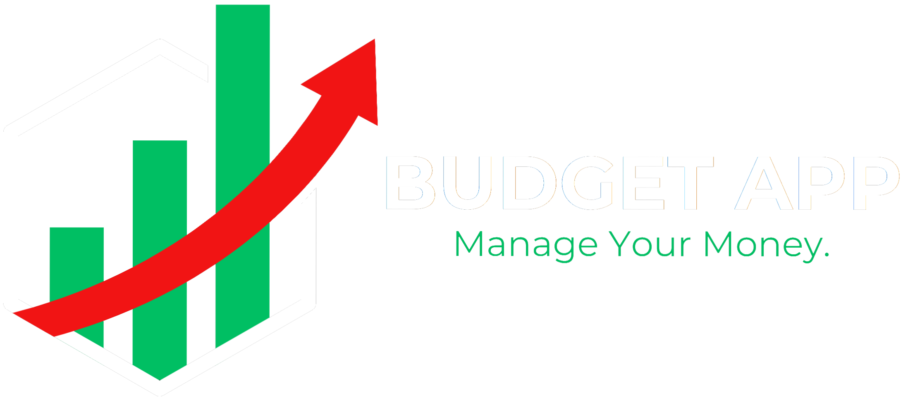
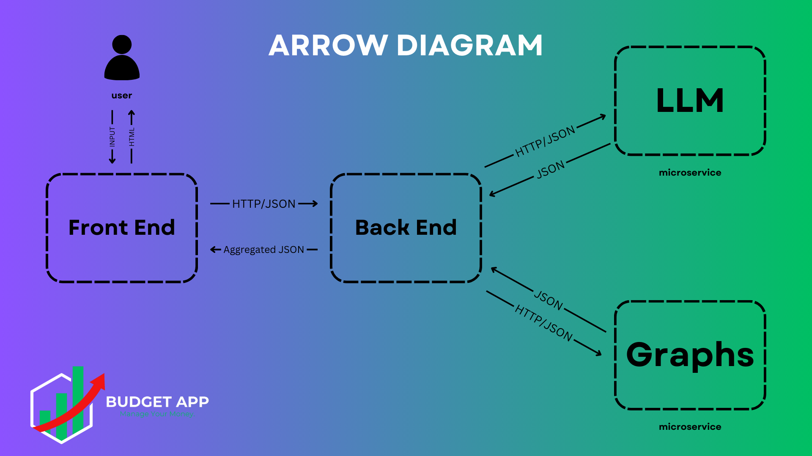

# 🌟 Budget App

<div align="center">
  

  A comprehensive financial management solution powered by AI and microservices architecture.

  [](https://fastapi.tiangolo.com)
  [](https://reactjs.org)
  [](https://docker.com)
</div>

The **Budget App** is a full-stack application designed to help users effectively manage their finances. Featuring a modern React frontend, a FastAPI backend, and cutting-edge technologies like LLM (Large Language Model) integration and Pydantic, this app provides personalized financial insights and suggestions based on user data. Dockerized for seamless deployment, the app supports a microservice architecture to enhance scalability.

---

## 🚀 Features

- **Financial Tracking:** Manage balances, incomes, and expenses with ease.
- **Personalized Insights:** Get actionable financial suggestions powered by LLM.
- **Microservices:** Modular FastAPI architecture ensures scalability and maintainability.
- **Frontend Excellence:** Responsive React interface for a smooth user experience.
- **Docker Support:** Simplified deployment with Docker Compose.

---

## 🗂️ Project Structure

```bash
budget-app/
├── backend/     # Backend FastAPI service
├── frontend/    # Frontend React service
├── docker-compose.yml  # Orchestrates backend and frontend services
└── README.md    # Project documentation
```
<div align="center">
  
</div>

---
## Setting up the Project
Clone the repository and get into the folder:
```bash
git clone https://github.com/EASS-HIT-PART-A-2024-CLASS-VI/budget-app-eliorabaev.git 
cd budget-app-eliorabaev
```
---

## 🔑 Setting Up the .env File

To use the LLM-powered suggestions feature, you need to provide an API key for Google Gemini AI.

1. Visit [Google AI Studio](https://aistudio.google.com/apikey) to obtain your API key.
2. Create a `.env` file in the `backend/app/llm_microservice` directory and add the following line to the `.env` file, replacing `<YOUR_API_KEY>` with your actual key:
```bash
echo 'GEMINI_API_KEY=<YOUR_API_KEY>' > backend/app/llm_microservice/.env
```
3. Ensure the `.env` file is not accidentally committed to version control by adding it to `.gitignore`.
This API key is required to enable the financial suggestion feature powered by Google Gemini AI.

---

## 🐳 Docker Deployment
#### Prerequisites

- Docker installed on your machine.

#### Installation

Build and run the Docker containers:
```bash
docker-compose up
```
---

## 📖 Backend

### 📌 Overview
The backend is built with **FastAPI**, designed to provide financial insights, manage budgets, and integrate with microservices for enhanced functionality.

### 🔹 Features
✅ **Microservice Architecture** - Supports modular and scalable design.  
✅ **LLM Integration** - Uses AI to generate personalized financial suggestions.  
✅ **Graph Microservice** - Provides financial balance projections.  
✅ **State Management** - Tracks balance, income, and expenses dynamically.  
✅ **Pydantic Validation** - Ensures robust data integrity.  
✅ **Dockerized** - Easy to deploy using Docker & Docker Compose.  

### 📂 Backend Directory Structure
```bash
backend/
├── Dockerfile                # Backend Docker configuration
├── app/
│   ├── main.py               # FastAPI application entry point
│   ├── state.py              # State management for balance tracking
│   ├── requirements.txt      # Python dependencies
│   ├── core/
│   │   ├── config.py         # Configuration settings
│   │   └── utils.py          # Utility functions
│   ├── llm_microservice/
│   │   ├── Dockerfile
│   │   ├── app/
│   │   │   ├── main.py
│   │   │   ├── models/
│   │   │   │   ├── schemas.py
│   │   │   ├── services/
│   │   │   │   ├── llm_service.py
│   │   │   ├── prompts/
│   │   │   │   └── financial_advisor_prompt.txt
│   │   └── requirements.txt
│   ├── graph_microservice/
│   │   ├── Dockerfile
│   │   ├── app/
│   │   │   ├── main.py
│   │   │   ├── models/
│   │   │   │   └── graph_models.py
│   │   │   ├── routes/
│   │   │   │   └── graph_routes.py
│   │   │   ├── tests/
│   │   │   │   └── test_graph_routes.py
│   │   └── requirements.txt
│   ├── models/
│   │   └── balance.py        # Data models for balance, income, and expenses
│   ├── routers/
│   │   ├── balance.py        # API routes for balance
│   │   ├── expense.py        # API routes for expenses
│   │   ├── income.py         # API routes for incomes
│   │   └── suggestions.py    # API routes for AI suggestions
│   ├── services/
│   │   ├── balance_service.py
│   │   ├── expense_service.py
│   │   ├── income_service.py
│   │   └── suggestion_service.py
│   ├── tests/
│   │   └── unit_test.py      # Unit tests for the application
└── client.py                 # API client (if applicable)
```

### 🛠️ Configuration
Create a `.env` file in the `backend/` directory with:
```env
APP_NAME=Budget App
VERSION=1.0.0
CORS_ORIGINS=["http://localhost:3000"]
DEBUG=True
```

### 🚀 Running the Backend

### 1️⃣ Clone the Repository
```sh
git clone https://github.com/EASS-HIT-PART-A-2024-CLASS-VI/budget-app-eliorabaev.git 
cd budget-app-eliorabaev/backend
```

### 2️⃣ Run with Docker
```sh
docker build -t budget-app-backend .
docker run -d --name budget-app-backend -p 8000:8000 budget-app-backend
```

### 3️⃣ Access API
Open [http://localhost:8000](http://localhost:8000) to test the API.

### 🔥 API Endpoints

### 📌 Balances
- **POST /balance/** - Set an initial balance:
```sh
curl -X POST "http://localhost:8000/balance/" -H "Content-Type: application/json" -d '{"amount": 1000}'
```
- **GET /balance/{balance_id}** - Retrieve balance:
```sh
curl -X GET "http://localhost:8000/balance/1"
```
- **PATCH /balance/{balance_id}** - Update balance:
```sh
curl -X PATCH "http://localhost:8000/balance/1" -H "Content-Type: application/json" -d '{"amount": 1500}'
```


### 📌 Incomes
- **POST /incomes/** - Add income:
```sh
curl -X POST "http://localhost:8000/incomes/" -H "Content-Type: application/json" -d '{"balance_id": 1, "source": "Job", "amount": 500}'
```
- **GET /incomes/{income_id}** - Retrieve income:
```sh
curl -X GET "http://localhost:8000/incomes/1"
```
- **GET /incomes/** - Retrieve all incomes:
```sh
curl -X GET "http://localhost:8000/incomes/"
```
- **PATCH /incomes/{income_id}** - Update income:
```sh
curl -X PATCH "http://localhost:8000/incomes/1" -H "Content-Type: application/json" -d '{"amount": 600}'
```

### 📌 Expenses
- **POST /expenses/** - Add an expense:
```sh
curl -X POST "http://localhost:8000/expenses/" -H "Content-Type: application/json" -d '{"balance_id": 1, "category": "Food", "amount": 100}'
```
- **GET /expenses/{expense_id}** - Retrieve expense:
```sh
curl -X GET "http://localhost:8000/expenses/1"
```
- **GET /expenses/** - Retrieve all expenses:
```sh
curl -X GET "http://localhost:8000/expenses/"
```
- **PATCH /expenses/{expense_id}** - Update expense:
```sh
curl -X PATCH "http://localhost:8000/expenses/1" -H "Content-Type: application/json" -d '{"amount": 120}'
```


### 📌 Financial Suggestions
- **POST /suggestions/{balance_id}** - Get AI-powered financial recommendations:
```sh
curl -X POST "http://localhost:8000/suggestions/1"
```
- **GET /suggestions/{balance_id}** - Retrieve cached financial suggestions:
```sh
curl -X GET "http://localhost:8000/suggestions/1"
```
- **GET /balance/{balance_id}/graph** - Get balance projections and revenue estimates:
```sh
curl -X GET "http://localhost:8000/balance/1/graph"
```

### 📌 Delete Data
- **DELETE /incomes/{income_id}** - Delete income:
```sh
curl -X DELETE "http://localhost:8000/incomes/1"
```
- **DELETE /expenses/{expense_id}** - Delete expense ():
```sh
curl -X DELETE "http://localhost:8000/expenses/1"
```
- **DELETE /balance/{balance_id}** - Delete balance:
```sh
curl -X DELETE "http://localhost:8000/balance/1"
```


### 🛠️ Technologies Used
- 🚀 FastAPI
- 🤖 Google Gemini AI (LLM Microservice)
- 📊 Graph Data Analysis (Graph Microservice)
- 🐳 Docker
- ⚡ Uvicorn
- 🧪 Pytest

### 🧪 Running Tests

- **Backend Tests:**
```bash
pytest backend/
```
---
## 🤖 LLM microservice

### 📌 Overview
This microservice is a FastAPI-based AI-powered financial advisory system that leverages **Google Gemini AI** to provide personalized financial insights and recommendations based on user financial data.

### ✨ Features
✅ REST API built with FastAPI  
✅ AI-driven financial analysis using Google Gemini AI  
✅ Structured JSON output format  
✅ Dockerized for easy deployment  
✅ Configurable environment variables  

### 📂 Structure
```sh
.
├── .env                  # Environment file (API key required)
├── Dockerfile            # Docker configuration
├── app
│   ├── api
│   │   └── routes.py      # API routes
│   ├── core
│   │   └── config.py      # Configuration settings
│   ├── main.py           # FastAPI entry point
│   ├── models
│   │   └── schemas.py     # Pydantic models
│   ├── prompts
│   │   └── financial_advisor_prompt.txt  # Prompt template
│   ├── services
│   │   └── llm_service.py # AI processing logic
│   └── utils
│       └── logger.py      # Logging utility
└── requirements.txt       # Dependencies
```

### 🔥 API Endpoints
### 📌 Get Financial Suggestions
📍 **Endpoint:** `POST /suggestions/`

📤 **Request Body (JSON):**
```json
{
  "balance_id": 123,
  "current_balance": 5000.0,
  "total_income": 7000.0,
  "total_expense": 3000.0
}
```

📥 **Response Example:**
```json
{
  "balance_id": 123,
  "current_balance": 5000.0,
  "total_income": 7000.0,
  "total_expense": 3000.0,
  "analysis": {
      "cash_flow_status": "Positive",
      "summary": "Your finances are in good shape.",
      "warnings": [],
      "positives": ["Good income balance"]
  },
  "swot": {
      "strengths": ["Strong cash flow"],
      "weaknesses": ["Limited investments"],
      "opportunities": ["Increase savings"],
      "threats": ["Unexpected expenses"]
  },
  "suggestions": [
      {
          "category": "Investing",
          "details": "Consider investing 20% of your income.",
          "priority": 1,
          "impact": "High",
          "level_of_effort": "Medium",
          "steps": ["Set up an investment account", "Allocate funds"],
          "reference_url": "https://example.com/investing"
      }
  ],
  "generated_at": "2025-02-09T12:00:00Z"
}
```

### 🛠️ Technologies Used
- 🚀 FastAPI
- 📌 Pydantic
- 🤖 Google Gemini AI
- 🐳 Docker
- ⚡ Uvicorn
---
## 📊 Graph service

### 📌 Overview
This is a FastAPI-based service that provides financial balance projections and revenue estimates using a structured graphing approach.

### ✨ Features
✅ REST API built with FastAPI  
✅ Balance projections over a range of years  
✅ Yearly revenue estimation with 8% compounding  
✅ Structured JSON output format  
✅ Dockerized for easy deployment  

### 📂 Project Structure
```sh
.
├── Dockerfile            # Docker configuration
├── app
│   ├── main.py           # FastAPI entry point
│   ├── models
│   │   └── graph_models.py  # Pydantic models for graph data
│   ├── routes
│   │   └── graph_routes.py  # API routes for graph operations
│   └── tests
│       └── test_graph_routes.py  # API test cases
└── requirements.txt       # Dependencies
```
### 🔥 API Endpoints
### 📌 Get Balance Projection
📍 **Endpoint:** `GET /balance-graph/{balance_id}`

📤 **Query Parameters:**
- `year` _(optional)_: Target year for balance projection (default: current year + 15)

📥 **Response Example:**
```json
[
  { "year": 2025, "balance": 10500.0 },
  { "year": 2026, "balance": 15300.0 }
]
```

### 📌 Get Projected Revenue
📍 **Endpoint:** `GET /projected-revenue/{balance_id}`

📤 **Query Parameters:**
- `year` _(optional)_: Target year for revenue projection (default: current year + 15)

📥 **Response Example:**
```json
[
  { "year": 2025, "projected_balance": 11000.0 },
  { "year": 2026, "projected_balance": 16800.0 }
]
```


### 🛠️ Technologies Used
- 🚀 FastAPI
- 📌 Pydantic
- 🔗 HTTPX (for async requests)
- 🐳 Docker
- ⚡ Uvicorn

---

## 🌐 Frontend

The frontend of the Budget App is built using **React** to provide a seamless and responsive user experience. It integrates with backend services to offer real-time financial insights, utilizing modern web development practices.

### ✨ Key Features

- **Dynamic Financial Insights:** Presents financial analysis, recommendations, and graphical data representations.
- **State Persistence:** Utilizes `sessionStorage` to optimize API requests and enhance performance.
- **Modular Architecture:** Built with reusable React components to maintain scalability and maintainability.
- **Theming & Styling:** Implements CSS variables and modular CSS for a consistent UI/UX.
- **Robust Error Handling:** Uses an `ErrorBoundary` component to prevent application crashes.

### 📂 Project Structure

```bash
frontend/
├── Dockerfile                  # Docker configuration for containerizing the frontend app
├── package-lock.json           # Locks dependencies to ensure consistent builds
├── package.json                # Project metadata, scripts, and dependencies
├── public
│   ├── favicon.ico             # App icon
│   └── index.html              # Main HTML entry point
├── __mocks__                   # Mock directory for testing
│   └── react-router-dom.js      # Mock implementation of react-router-dom
└── src                         # Source code directory
    ├── api.js                  # API utility functions for backend communication
    ├── App.js                  # Main React component handling routes
    ├── components              # Modular and reusable React components
    │   ├── AboutMe.js          # About Me page component
    │   ├── Balance.js          # Balance management component
    │   ├── BudgetSteps.js      # Step-based budgeting process component
    │   ├── Expense.js          # Expense tracking component
    │   ├── GraphComponent.js   # Graph visualization component
    │   ├── Header.js           # Navigation bar component
    │   ├── Homepage.js         # Main landing page
    │   ├── Income.js           # Income tracking component
    │   ├── Suggestions.js      # Financial suggestions display component
    ├── ErrorBoundary.js        # Global error handling component
    ├── fonts                   # Custom fonts used in the app
    ├── static                  # Static assets (CSS, images, etc.)
    │   ├── css                 # Component stylesheets
    │   └── images              # Logos and other assets
```

### 🛠️ Setup & Installation

#### Prerequisites
- Docker installed on your machine.
- Node.js (if running without Docker)

#### Running with Docker

1. Navigate to the frontend directory:
```bash
cd frontend
```
2. Build and run the Docker container:
```bash
docker build -t budget-app-frontend .
docker run -d --name budget-app-frontend -p 3000:3000 budget-app-frontend
```
3. Access the application in your browser:
```
http://localhost:3000
```

#### Running Locally (Without Docker)

1. Install dependencies:
```bash
npm install
```
2. Start the development server:
```bash
npm start
```
3. The application will be available at:
```
http://localhost:3000
```

### 🧪 Running Tests

To run tests, use the following command:
```bash
npm test
```
This will execute all test cases using Jest and React Testing Library.

### ✅ Best Practices & Notes

- Follow modular component design for scalability.
- Ensure API responses are handled gracefully with proper error boundaries.
- Use `sessionStorage` wisely to minimize redundant API requests.
- Maintain consistent styling with CSS modules and variables.

This frontend is designed to be efficient, scalable, and user-friendly, making financial planning effortless for users.

---


## 🎉 Conclusion

Thank you for exploring the **Budget App**! Feel free to contribute, report issues, or suggest enhancements. Happy budgeting! 🤑
